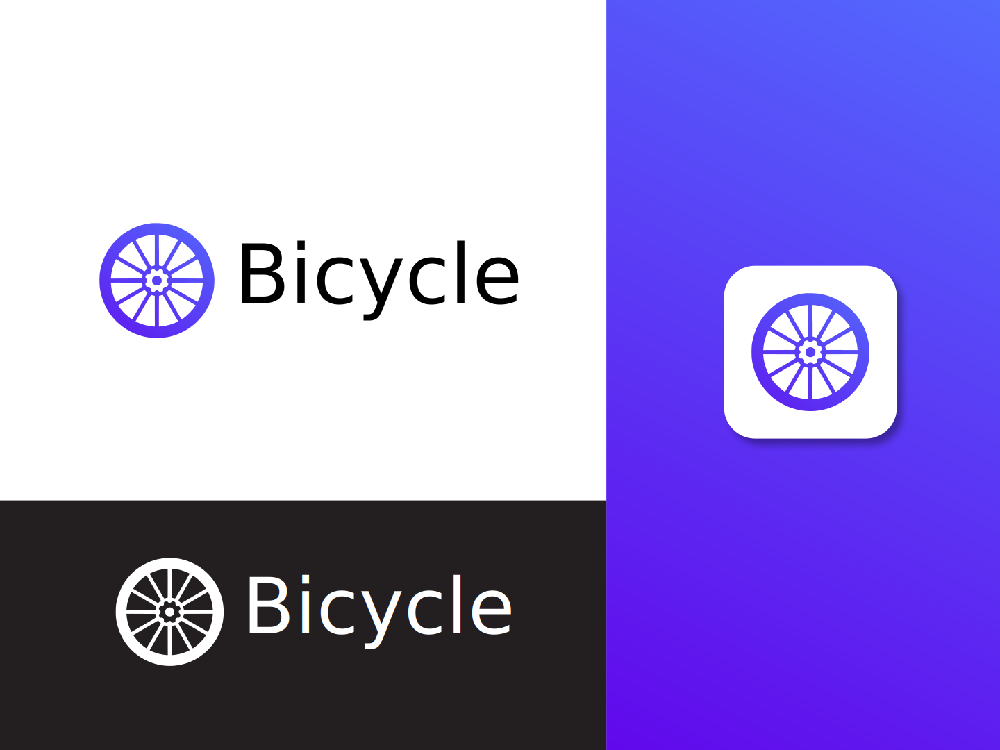

The bicycle website now has a shiny new logo and website.  Here's the new logo:

With dedicated guides to getting started with either:

 - [Plain JavaScript](/docs/getting-started-js.html)
 - [TypeScript](/docs/getting-started-ts.html)

Bicycle is an alternative to Apollo/Relay that aims to be easier to use by handling updating the cache after mutations completely automatically. To do this, it does require a node.js backend, but you can still bring any database of your choice.

Over the next few weeks, I'm going to be working on fleshing out the reference API.